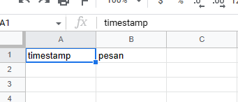
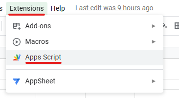
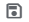
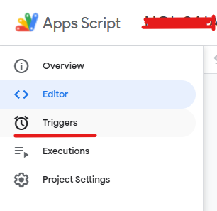
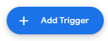
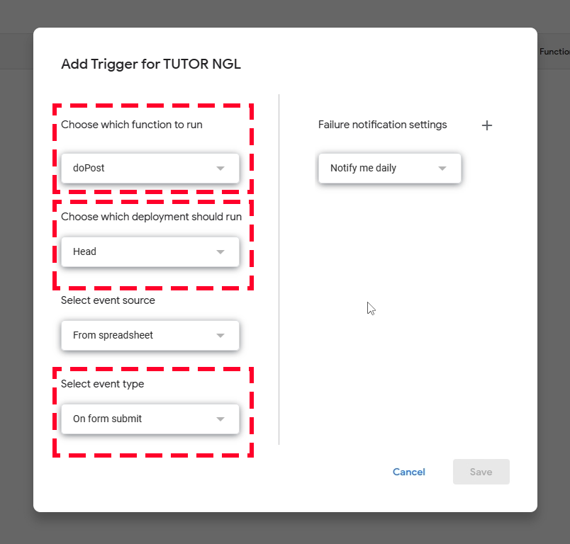
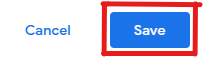

# NGL BUT NOT REALY

Berikut caranya membuat ngl sendiri

> ### Note:
>
> - Disini aku pakai Google yang berbahasa Inggris. Jadi, untuk bahasa Indonesia bisa disesuaikan.

1.  Buka [Google Spreadsheet](https://docs.google.com/spreadsheets/) di laptop
2.  Buat tabel seperti di bawah
    | timestamp|pesan|
    |---|---|

    

3.  Lalu ke `Extension`. Klik opsi `Apps Script`.
    
4.  Kamu diarahkan ke tab baru ke script.google.com
5.  Copy kode di bawah. lalu pastekan ke `Apps Script`

    ```js
    var sheetName = "Sheet1";
    var scriptProp = PropertiesService.getScriptProperties();
    function intialSetup() {
      var activeSpreadsheet = SpreadsheetApp.getActiveSpreadsheet();
      scriptProp.setProperty("key", activeSpreadsheet.getId());
    }
    function doPost(e) {
      var lock = LockService.getScriptLock();
      lock.tryLock(10000);
      try {
        var doc = SpreadsheetApp.openById(scriptProp.getProperty("key"));
        var sheet = doc.getSheetByName(sheetName);
        var headers = sheet
          .getRange(1, 1, 1, sheet.getLastColumn())
          .getValues()[0];
        var nextRow = sheet.getLastRow() + 1;
        var newRow = headers.map(function (header) {
          return header === "timestamp" ? new Date() : e.parameter[header];
        });
        sheet.getRange(nextRow, 1, 1, newRow.length).setValues([newRow]);
        return ContentService.createTextOutput(
          JSON.stringify({ result: "success", row: nextRow })
        ).setMimeType(ContentService.MimeType.JSON);
      } catch (e) {
        return ContentService.createTextOutput(
          JSON.stringify({ result: "error", error: e })
        ).setMimeType(ContentService.MimeType.JSON);
      } finally {
        lock.releaseLock();
      }
    }
    ```

6.  Lalu klik tombol `Save` &nbsp; 
7.  Klik Sidebar, masuk menu Triggers

    

8.  Tambahkan trigger dengan klik tombol

    

9.  Maka muncul form. Isi seperti di bawah ini.

    

10. Klik tombol `Save`.

    

11. Jika muncul seperti di bawah ini

    

    Pilih akun yang sama dengan akun di spreadsheet dan App Script

12. Lalu akan muncul seperti ini

    

    Klik `Advanced`. Lalu muncul seperti di bawah ini

    

    Klik `Go to xxxxxx (unsafe)`


14. Setelah itu, klok tombol `Deploy` di navbar. Akan muncul form. Pilih App Type `Web App`. Lalu klik `Deploy di form`.
15. Copy untuk Web URL nya dengan klik tombol `Copy`. Simpan dulu. Karena itu nanti dibutuhkan.
16. Buat halamannya dengan masuk ke [sini](http://nggaaa.github.io/create.html)
17. Isi formnya. Lalu klik Generate.
18. Setelah loading, kode telah dibuatkan. Copy lalu buka notepad lalu paste. Save dengan nama index.html.

## Links

- [form-to-google-sheets](https://github.com/jamiewilson/form-to-google-sheets) by [jamiewilson](https://github.com/jamiewilson)
- [Tailwind CSS](https://tailwindcss.com/) by [Adam Wathan](https://twitter.com/adamwathan)
- [Apps Script](https://script.google.com/)
- [Google Spreadsheet](http://docs.google.com/spreadsheets)
